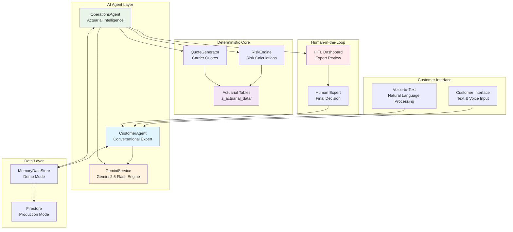
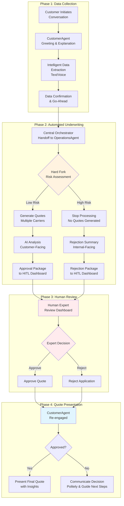
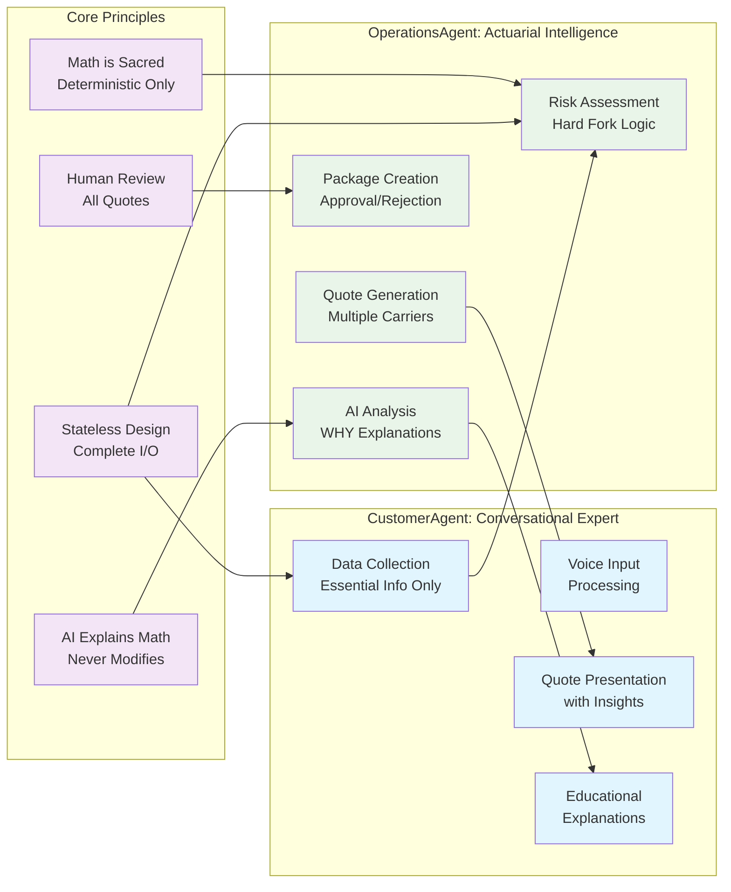
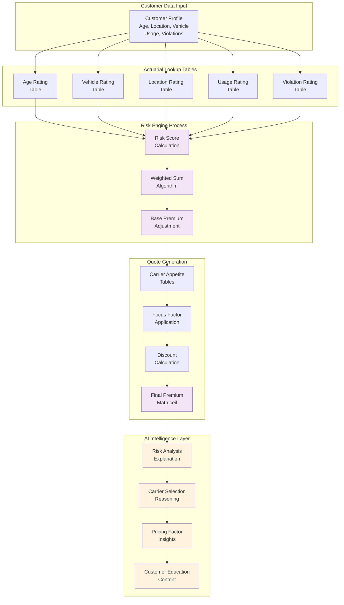
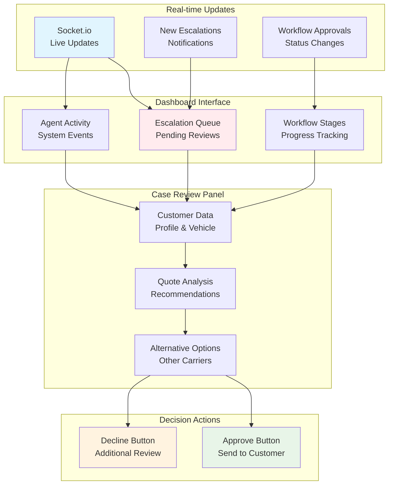
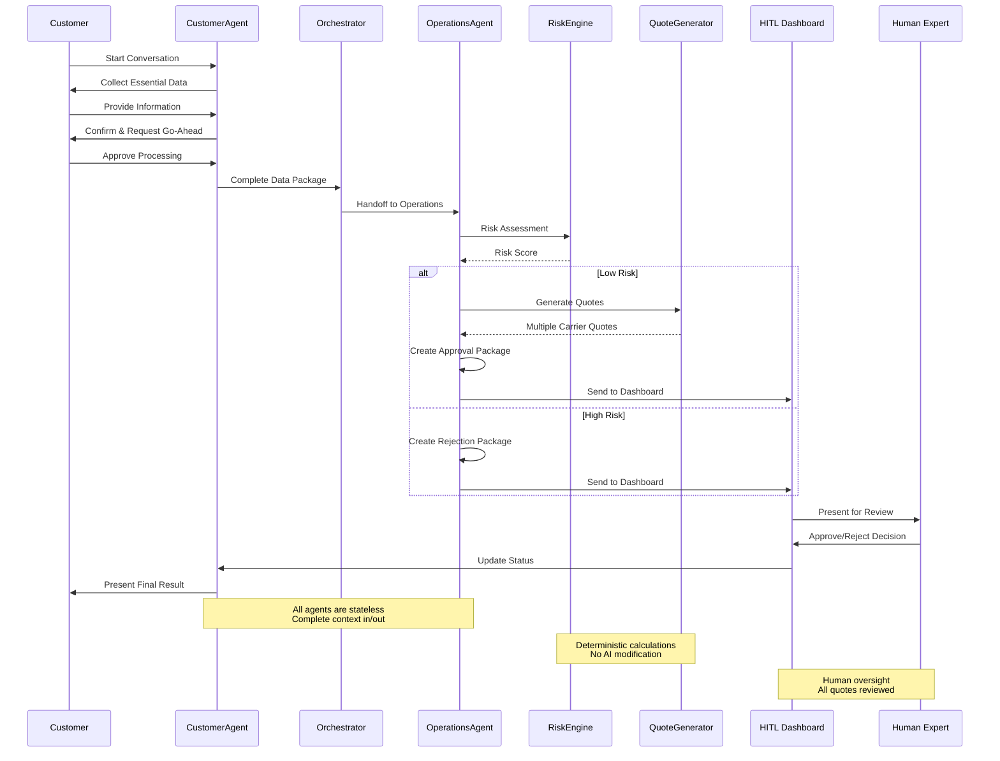
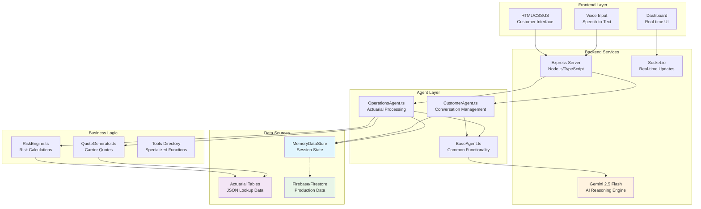
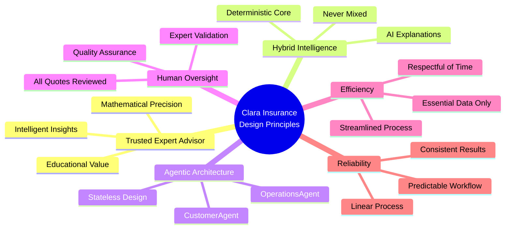

# Clara Insurance System Architecture & Workflow

This document contains comprehensive Mermaid diagrams that visualize the Clara Insurance system architecture, workflow, and key components based on the Trusted Expert Advisor manifesto and executive summary.

## System Architecture Overview

## End-to-End Customer Journey

## Agent Architecture & Responsibilities

## Deterministic Calculation Flow

## HITL Dashboard System

## Data Flow & State Management

## Technology Stack & Integration

## Key Design Principles

